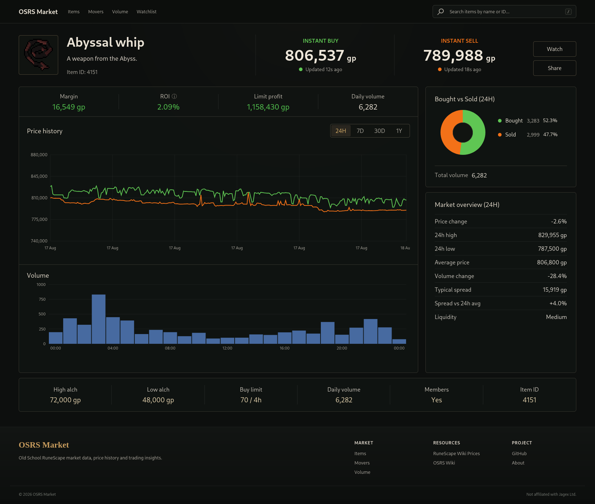

# OSRS Market

OSRS Market is a full-stack Old School RuneScape market data project built as a practical exercise in modern C++ backend development.

The application collects item metadata and real-time Grand Exchange price data from the RuneScape Wiki APIs, persists historical market information, and exposes the data through its own API for a React frontend.

The goal is to build a fast, self-contained market data service that does not require the frontend to depend directly on the upstream API.

## Screenshots
[▶ Watch the 15-second item page demo](docs/video/item-page-desktop.mp4)



## Project Status

This project is currently under active development. The core backend data pipeline and the first complete item-market frontend are now working end to end.

Implemented:

- C++20 backend with Crow
- RuneScape Wiki item mapping synchronization
- Local item icon caching
- PostgreSQL persistence and item metadata revision history
- In-memory metadata and latest-price stores
- Bulk 5-minute market price collection
- Change-based price event persistence
- Background price collection
- Historical timeseries API
- Startup gap recovery after collector downtime
- Coverage-aware history caching that avoids caching incomplete ranges
- 24-hour, 7-day, 30-day, and 1-year history ranges
- React + TypeScript item page integrated with the C++ API
- Item search by name or ID
- Price and volume charts
- Bought vs sold 24-hour volume visualization
- Market statistics including margin, ROI, limit profit, price change, spread, volume, and liquidity
- Responsive desktop, tablet, and mobile layouts
- Sticky responsive navigation and search
- About page and site footer
- Client-side history caching by range for fast chart switching
- Periodic frontend history refresh
- Docker development environment
- Production Docker Compose stack with Nginx frontend proxy and service health checks
- PostgreSQL first-run schema initialization from `backend/sql`
- Backend SQL migration runner for incremental schema updates
- Non-blocking backend startup workers for mapping refresh, gap recovery, icons, and price collection
- Interactive chart zoom with synchronized price, volume, and trade distribution data
- Persistent client-side watchlist with slide-out drawer, drag-and-drop ordering, and per-item range selection
- Watchlist midpoint price tracking with 30m, 1h, 6h, 12h, and 24h comparisons
- Per-item price tracking from the moment an item is added to the watchlist
- Watched-since marker on the price history chart
- Watch-summary API backed by the shared `PriceHistoryCache`
- Per-item watchlist summary refresh scheduling with localStorage persistence
- Reliable historical backfill: Historical price points now use the timestamps supplied by the Wiki API. Missing ranges are queued for background backfill when requested, while successful backfills are tracked separately from actual trade coverage. This correctly supports new, sparse, and rarely traded items without repeatedly downloading the same history.

Planned / next steps:

- Movers and volume discovery pages
- Share functionality
- Additional market statistics and aggregation
- WebSocket live price updates for actively viewed items (instant buy / sell)
- Further frontend and backend performance hardening
- Historical price retention and rollup: retain high-resolution
  5-minute market data for the recent 24-hour window, aggregate older
  data into hourly history, archive raw events for future analytics,
  and remove expired high-resolution rows from the live database
- Item lifecycle validation: Detect and store an item's official release date or earliest valid market date when it first appears in the mapping. Historical queries and backfills will use this boundary to reject impossible records from before the item's release. This will also protect against reused item IDs previously associated with temporary League, Deadman Mode, beta, or removed content.

---

## Stack

### Backend

- C++20
- Crow
- CPR / libcurl
- nlohmann/json
- libpqxx
- PostgreSQL
- CMake
- Ninja

### Frontend

- React
- TypeScript
- Vite
- Recharts

### Infrastructure

- Docker
- Docker Compose
- PostgreSQL
- Git / GitHub

---

## Architecture

The backend acts as an intermediary between the RuneScape Wiki price APIs and the frontend.

```text
                   RuneScape Wiki APIs
                          |
             +------------+------------+
             |                         |
         Item Mapping                5m Prices
             |                         |
             v                         v
     MappingRefreshJob       FiveMinutePriceRefreshJob
             |                         |
      +------+------+            +-----+------+
      |             |            |            |
      v             v            v            v
 PostgreSQL    MappingStore  LatestPriceStore PostgreSQL
                  (RAM)          (RAM)       price_events
      |
      v
 Item revisions

                  Backend API
                       |
                       v
                 React Frontend
```

The frontend does not need to communicate directly with the RuneScape Wiki APIs.

This allows the backend to continue serving previously collected data if the upstream API is temporarily unavailable.

---

# Item Metadata

Item metadata is obtained from the RuneScape Wiki mapping API.

Examples of metadata include:

- Item ID
- Name
- Examine text
- Members status
- Store value
- High alchemy value
- Low alchemy value
- Grand Exchange buy limit
- Icon filename

Metadata is persisted in PostgreSQL.

## Item Revisions

Item metadata can change over time.

Instead of overwriting the existing item information, the backend stores revisions.

```text
items
  |
  +-- current_revision_id
          |
          v
    item_revisions
```

For example:

```text
Item 6739
Dragon axe

Revision 1
    name: Dragon axe
    examine: Old description

Revision 2
    name: Dragon axe
    examine: New description
```

Only a changed item creates a new revision.

This preserves historical metadata while allowing the application to efficiently reference the current revision.

---

# Item Icons

Item icons are downloaded from the Old School RuneScape Wiki and stored locally.

They are exposed by the backend using URLs such as:

```text
/icons/6739.png
```

The item API therefore returns:

```json
{
    "id": 6739,
    "name": "Dragon axe",
    "icon": "/icons/6739.png"
}
```

rather than requiring the frontend to know the upstream Wiki image URL.

Downloaded icons are stored in a Docker volume and survive container rebuilds.

Known missing icons are temporarily remembered to prevent repeatedly requesting the same unavailable resource.

---

# Price Collection

The backend uses the RuneScape Wiki bulk 5-minute price endpoint.

```text
/api/v2/osrs/5m
```

One request provides market information for many items.

This is significantly more efficient than requesting every item individually.

A normalized price point contains:

```text
itemId
timestamp
avgHighPrice
avgLowPrice
highPriceVolume
lowPriceVolume
```

Prices can be null when no corresponding trade occurred during the interval.

---

## Change-Based Price History

The backend does not blindly store every observation.

Instead, the latest known market state for each item is held in memory.

```text
Wiki /5m
    |
    v
LatestPriceStore
    |
    +-- unchanged --> ignore
    |
    +-- changed ----> price_events
```

A price event is considered changed when one or more of these values changes:

```text
avgHighPrice
avgLowPrice
highPriceVolume
lowPriceVolume
```

This avoids storing unnecessary duplicate observations for inactive items.

PostgreSQL additionally enforces uniqueness on:

```text
(item_id, timestamp)
```

so the same 5-minute event cannot accidentally be inserted twice.

---

# Database

The application currently uses PostgreSQL for persistent storage.

Main tables:

```text
items
item_revisions
price_events
```

## `items`

Stores stable item identities and points to the current metadata revision.

## `item_revisions`

Stores historical versions of item metadata.

## `price_events`

Stores historical market changes.

The primary history access pattern is:

```sql
WHERE item_id = ?
AND timestamp >= ?
ORDER BY timestamp
```

The table therefore has an index based on:

```text
(item_id, timestamp)
```

Historical storage may later be partitioned or aggregated as the dataset grows.

---

# Database Migrations

Fresh PostgreSQL volumes are initialized from:

backend/sql

Incremental schema changes after the initial database setup belong in:

backend/migrations

The backend runs pending migration files on startup before repositories, caches, workers, or Crow routes are initialized.

Applied migrations are recorded in schema_migrations, so each file runs only once.

The schema_migrations table is part of the base SQL initialization for new databases.

---

# In-Memory Stores

PostgreSQL is the durable source of data, but frequently accessed current state is also kept in memory.

There are currently two major in-memory stores.

## MappingStore

Contains the current item metadata.

Conceptually:

```cpp
std::unordered_map<ItemId, ItemMapping>
```

This allows item API requests to avoid querying PostgreSQL for every request.

## LatestPriceStore

Contains the newest known price state for each item.

Conceptually:

```cpp
std::unordered_map<ItemId, PricePoint>
```

It is used to detect market changes before writing historical events.

This store will also eventually provide the current state for WebSocket updates.

---

# Backend Startup Flow

The backend intentionally restores persistent state before starting its background collectors.

The startup process is approximately:

```text
main()
 |
 +--> Read DATABASE_URL
 |
 +--> Run pending database migrations
 |
 +--> Connect to PostgreSQL
 |      |
 |      +--> item database connection
 |      |
 |      +--> price database connection
 |
 +--> Create repositories
 |      |
 |      +--> ItemRepository
 |      |
 |      +--> PriceRepository
 |
 +--> Hydrate LatestPriceStore
 |      |
 |      +--> Load latest price event for each item
 |      |
 |      +--> Store latest states in RAM
 |
 +--> Hydrate MappingStore
 |      |
 |      +--> Load current item revisions
 |      |
 |      +--> Store current item metadata in RAM
 |
 +--> Launch background workers
        |
        +--> MappingRefreshJob
        |
        +--> GapRecoveryJob
        |
        +--> IconDownloadWorker
        |
        +--> FiveMinutePriceRefreshJob
 |
 +--> Start Crow HTTP server
```

The HTTP server serves from the cached PostgreSQL state while the fresh item mapping sync runs in the background. When the sync completes, it replaces `MappingStore`.

This keeps Crow responsive during local development and production restarts even when item synchronization takes time.

The `backfill-all` command is different: it runs the mapping refresh synchronously before full history backfill because the backfill job needs a populated `MappingStore`.

```text
backfill-all
 |
 +--> Refresh item mapping
 |
 +--> Run FullHistoryBackfillJob
 |
 +--> Exit
```

---

## Why Price State Is Hydrated First

`LatestPriceStore` is an in-memory cache.

Without restoring it from PostgreSQL, every backend restart would make the first `/5m` response appear to contain completely new data.

For example:

```text
Backend stops

RAM:
    empty

Backend starts

GET /5m
    |
    v
1882 items appear "new"
```

The database uniqueness constraint would prevent duplicate rows, but this would still cause thousands of unnecessary insert attempts.

Instead:

```text
Backend starts
    |
    v
PostgreSQL
    |
    v
load latest event per item
    |
    v
LatestPriceStore
    |
    v
GET /5m
    |
    v
compare against known state
```

Only genuinely changed market states are then written.

---

# Runtime Price Flow

Once startup is complete, price collection runs independently in the background.

```text
FiveMinutePriceRefreshJob
          |
          v
 GET RuneScape Wiki /5m
          |
          v
      parse JSON
          |
          v
     ItemFilter
          |
          v
  LatestPriceStore
          |
     +----+----+
     |         |
 unchanged   changed
     |         |
   ignore      v
          PriceRepository
                |
                v
           PostgreSQL
           price_events
```

The refresh job currently runs periodically in its own thread.

The HTTP server therefore does not need to wait for upstream RuneScape Wiki requests when serving normal requests.

---

# Runtime Mapping Flow

Item metadata synchronization is handled separately.

```text
MappingRefreshJob
       |
       v
RuneScape Wiki /mapping
       |
       v
    ItemFilter
       |
       +--------------------+
       |                    |
       v                    v
ItemRepository         Icon queue
       |                    |
       v                    v
 PostgreSQL       IconDownloadWorker
       |
       v
revision detection
       |
       v
 MappingStore
     (RAM)
```

If metadata has not changed, no new revision is created.

If metadata changes, a new revision is inserted and the item's `current_revision_id` is updated.

---

# Database Connections and Concurrency

Background jobs execute concurrently.

A PostgreSQL connection cannot have multiple active transactions simultaneously, so independent workers do not share the same libpqxx connection.

Conceptually:

```text
Mapping worker
      |
      v
ItemRepository
      |
      v
PostgreSQL connection #1


Price worker
      |
      v
PriceRepository
      |
      v
PostgreSQL connection #2
```

A connection pool may replace this arrangement later as the number of concurrent database workloads grows.

---

# Historical Data Flow

The bulk `/5m` endpoint is used for ongoing market collection.

Historical timeseries endpoints are used for initial history population and recovery after collector downtime.

On startup, the backend checks the newest timestamp stored in `price_events`.

```text
Backend starts
      |
      v
Check MAX(price_events.timestamp)
      |
      +--> <= 10 minutes --> no recovery
      |
      +--> <= 24 hours --> recover using 24h history
      |
      +--> <= 7 days --> recover using 7d history
      |
      +--> > 7 days --> recover using 1y history
```

When a gap is detected, `GapRecoveryJob` runs in the background so recovery does not block the HTTP server.

Normal history requests are served from local PostgreSQL data and do not trigger per-item backfills.

A separate `backfill-all` command is available for initial database population or a complete historical synchronization.

After history has been populated, the continuous `/5m` collector extends it over time.

---

# Frontend History Refresh

The frontend loads historical data from the backend and keeps previously visited ranges in a client-side cache. Each range owns its own dataset, avoiding unnecessary chart reprocessing when switching between 24H, 7D, 30D, and 1Y views.

The currently selected range is refreshed periodically. Stale requests can be cancelled when navigation changes, while previously loaded ranges remain immediately available in memory.

Real-time WebSocket delivery is not currently required; the existing periodic refresh is intentionally kept simple unless future product requirements justify push-based updates.

---

---

# Watchlist

The frontend includes a persistent watchlist drawer for quick access to frequently viewed items.

Each watched item stores lightweight client-side state, including the selected comparison range and the most recent watch-summary response. The list is persisted in `localStorage`, so item order, selected ranges, and cached summaries survive page refreshes.

Supported comparison ranges:

```text
30m
1h
6h
12h
24h
```

The watchlist displays the current market midpoint, calculated from the
instant buy and instant sell prices.

Two price-change measurements are shown for each watched item:

- **Selected range** — compares the current midpoint with the historical
  midpoint at the start of the selected 30m, 1h, 6h, 12h, or 24h range.
- **Since added** — compares the current midpoint with the midpoint captured
  when the item was added to the watchlist.

The initial midpoint and watch timestamp are stored with the watched item,
allowing the frontend to preserve the original tracking point while current
watch-summary data continues to refresh.

When the watch timestamp falls within the visible price-history range, the
price chart displays a vertical marker showing when tracking began.

These percentages represent market price movement and do not include
Grand Exchange tax.

Watch-summary data is served by the backend using the existing 24-hour `PriceHistoryCache`. On a cache hit, no PostgreSQL history query is required. On a cache miss, the backend loads the 24-hour history from PostgreSQL, stores it in the shared cache when coverage is complete, and derives the closest available reference prices for the supported ranges.

Conceptually:

```text
Watch item
   |
   v
GET /api/items/<id>/watch-summary
   |
   v
PriceHistoryCache (24h)
   |
   +-- hit  --> derive reference prices
   |
   +-- miss --> PostgreSQL --> cache --> derive reference prices
   |
   v
30m / 1h / 6h / 12h / 24h references
   |
   v
React watchlist drawer
```

The client refresh scheduler tracks freshness per watched item. Rather than polling the entire list continuously, it schedules a single timeout for the closest next refresh time and only updates items whose summaries are stale. Returning to a previously backgrounded browser tab also triggers a stale-item check.

---

# Development

Start the development environment:

```bash
docker compose up
```

Build the C++ backend inside the development container:

```bash
docker compose exec backend cmake --build build
```

Restart the backend:

```bash
docker compose restart backend
```

Follow backend logs:

```bash
docker compose logs -f backend
```

Recent logs only:

```bash
docker compose logs --since=30s backend
```

# Production

The production stack runs as:

```text
Browser
  |
  | HTTPS (public domain)
  v
Reverse Proxy (optional)
  |  TLS termination / domain routing
  |
  | HTTP -> frontend exposed port
  v
Frontend Container
  |  Nginx :80
  |  - serves React static files
  |  - proxies /api/* and /icons/* to backend
  |
  | Docker internal network
  v
Backend Container
  |  Crow :8080
  |
  | Docker internal network
  v
PostgreSQL Container
     PostgreSQL :5432
```

The reverse proxy is optional. Without one, expose the frontend service directly through a host port in `docker-compose.prod.yml`.

The backend and PostgreSQL services do not need to be publicly exposed; communication between the frontend, backend, and database occurs over the internal Docker Compose network.

Docker health checks are configured for PostgreSQL, the backend API, and the frontend. The frontend waits for the backend to become healthy, while the backend waits for PostgreSQL.

On a fresh PostgreSQL volume, SQL files from `backend/sql` are mounted into `/docker-entrypoint-initdb.d` and executed automatically during first-time database initialization. Existing initialized volumes are left unchanged by PostgreSQL init scripts.

Incremental schema changes after first initialization are handled by the backend migration runner using SQL files from `backend/migrations`.

## Development

### Build

```bash
docker compose -f docker-compose.dev.yml build
```

### Start existing containers

```bash
docker compose -f docker-compose.dev.yml start
```

### Stop containers

```bash
docker compose -f docker-compose.dev.yml stop
```

### Create and start

```bash
docker compose -f docker-compose.dev.yml up -d
```

### Build and start

```bash
docker compose -f docker-compose.dev.yml up -d --build
```

### Stop and remove containers

```bash
docker compose -f docker-compose.dev.yml down
```

### Status

```bash
docker compose -f docker-compose.dev.yml ps
```

### Backend logs

```bash
docker compose -f docker-compose.dev.yml logs -f backend
```

### Frontend logs

```bash
docker compose -f docker-compose.dev.yml logs -f frontend
```

### PostgreSQL logs

```bash
docker compose -f docker-compose.dev.yml logs -f postgres
```

### Rebuild C++ backend inside running container

```bash
docker compose -f docker-compose.dev.yml exec backend cmake --build build
```

### Restart backend

```bash
docker compose -f docker-compose.dev.yml restart backend
```

---

## Production

### Build

```bash
docker compose \
  --env-file .env.production \
  -f docker-compose.prod.yml \
  build
```

### Start

```bash
docker compose \
  --env-file .env.production \
  -f docker-compose.prod.yml \
  up -d
```

### Stop

```bash
docker compose \
  --env-file .env.production \
  -f docker-compose.prod.yml \
  down
```

### Build and start

```bash
docker compose \
  --env-file .env.production \
  -f docker-compose.prod.yml \
  up -d --build
```

### Status

```bash
docker compose \
  --env-file .env.production \
  -f docker-compose.prod.yml \
  ps
```

### Backend logs

```bash
docker compose \
  --env-file .env.production \
  -f docker-compose.prod.yml \
  logs -f backend
```

---

# API

Current example item endpoint:

```text
GET /api/items/6739
```

Example response:

```json
{
    "buyLimit": 40,
    "examine": "A very powerful axe.",
    "highAlch": 33000,
    "icon": "/icons/6739.png",
    "id": 6739,
    "lowAlch": 22000,
    "members": true,
    "name": "Dragon axe",
    "value": 55000
}
```

Item icons:

```text
GET /icons/6739.png
```

Historical price data:

```text
GET /api/items/6739/history?range=24h
GET /api/items/6739/history?range=7d
GET /api/items/6739/history?range=30d
GET /api/items/6739/history?range=1y
```

Item search:

```text
GET /api/items/search?q=dragon
```

Watchlist price-change summary:

```text
GET /api/items/6739/watch-summary
```

Example response:

```json
{
  "itemId": 6739,
  "generatedAt": 1787262696,
  "currentMidPrice": 6912450,
  "references": {
    "30m": 6852761,
    "1h": 6951140,
    "6h": 6970347,
    "12h": 6875915,
    "24h": 6767910
  }
}
```

The reference values are historical midpoint prices derived from the closest
available points in the cached 24-hour history. `currentMidPrice` represents
the current market midpoint used by the frontend for range and watchlist
price-change calculations.

Historical requests are served entirely from local PostgreSQL data and do not trigger any backfill or background work.
Historical recovery is handled independently by `GapRecoveryJob`, which checks for gaps when the backend starts.

---

## Development & Maintenance Commands

### Build and start the backend

Build the backend image:

```bash
docker compose build backend
```

Start the backend service:

```bash
docker compose up -d backend
```

### Rebuild during development

Recompile the C++ backend inside the running development container and restart the service:

```bash
docker compose exec backend cmake --build build && \
docker compose restart backend
```

### Check item backfill status

View the completed historical backfills for a specific item:

```bash
docker compose exec postgres \
  psql -U osrs_market -d osrs_market \
  -c "
    SELECT
        item_id,
        lookback,
        last_completed_at
    FROM price_backfill_state
    WHERE item_id = 6739
    ORDER BY lookback;
  "
```

Replace `6739` with the desired item ID.

### Full history synchronization

Run the one-time full historical backfill for all tracked items:

```bash
docker compose run --rm backend \
  ./build/osrs-market-backend backfill-all
```

The temporary backend container is removed after the command completes. PostgreSQL data is persisted separately and is not removed. Normal startup gap recovery does not require this command.

### Monitor full backfill progress

Check how many items have completed each historical lookback:

```bash
docker compose exec postgres \
  psql -U osrs_market -d osrs_market \
  -c "
    SELECT
        lookback,
        COUNT(*) AS completed,
        ROUND(COUNT(*) * 100.0 / 4648, 2) AS percent
    FROM price_backfill_state
    GROUP BY lookback
    ORDER BY lookback;
  "
```

> `4648` is the current number of tracked items. Update this value if the mapping size changes.

---

# Data Source

Market and item data are sourced from the RuneScape Wiki / RuneLite real-time price APIs.

This project is not affiliated with Jagex, RuneScape, RuneLite, or the RuneScape Wiki.

Old School RuneScape and RuneScape are trademarks of Jagex Ltd.

---

# Project Goals

This project is primarily being developed to explore and practice:

- Modern C++ application architecture
- HTTP services in C++
- Concurrent background workers
- Background recovery jobs
- PostgreSQL from C++
- Time-series market data
- In-memory caching
- REST API design
- Dockerized C++ development
- Production deployment
- React/C++ integration
- Responsive frontend architecture
- Client-side caching and chart performance

---

## License

This project is source-available for educational, portfolio,
and security-review purposes.

Copyright © 2026. All rights reserved.

See [LICENSE](LICENSE) for details.